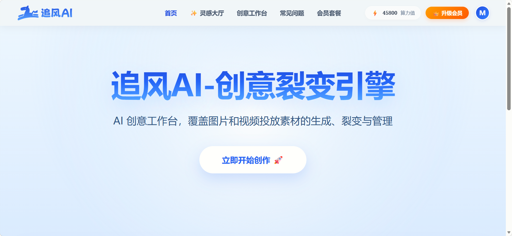
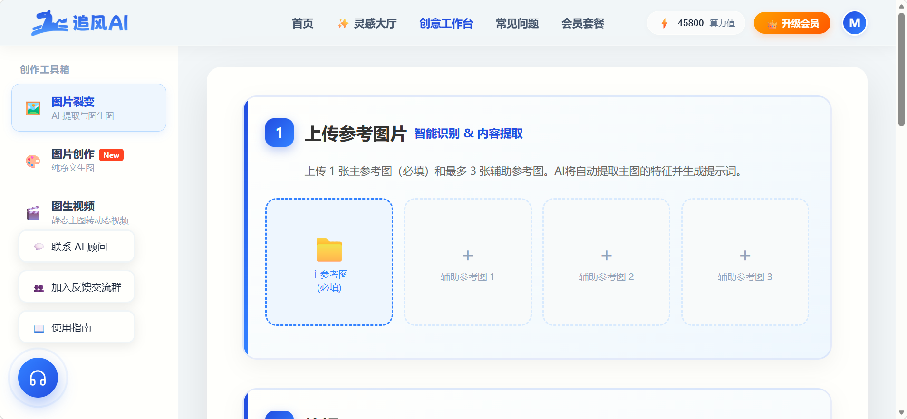
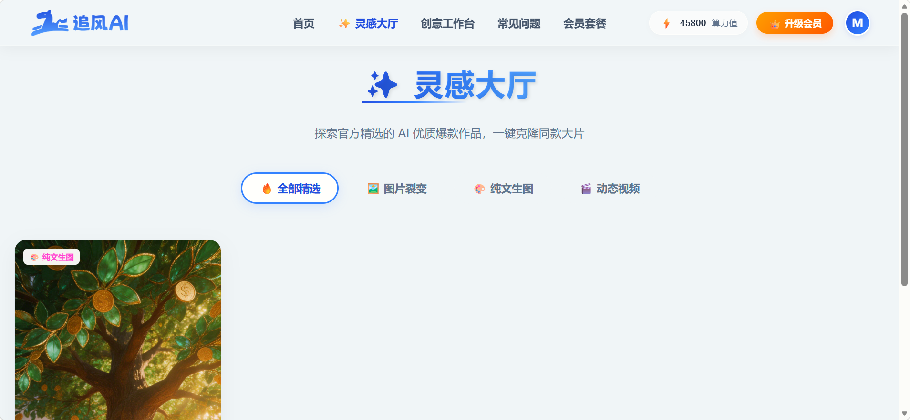

# ZhuiFeng AI Community Edition / 追风 AI 社区版

Build your own AI image workspace in minutes.  
几分钟内搭建你自己的 AI 图像工作台。

ZhuiFeng AI Community Edition is a self-hosted open-source workspace for **AI image generation**, **prompt extraction**, **inspiration gallery workflows**, and **lightweight video generation experiments**.  
追风 AI 社区版是一个可自部署的开源工作台，支持 **AI 图像生成**、**提示词提取**、**灵感画廊工作流** 以及 **轻量级视频生成实验**。

It is designed for developers, creators, and AI tool builders who want a clean, deployable starting point — while the hosted **Pro version** offers a smoother production experience with cloud features, batch workflows, and business-ready operations.  
它面向开发者、内容创作者和 AI 工具构建者，提供一个干净、可部署、可扩展的起点；而托管式 **Pro 版本** 则提供更顺滑的生产级体验，包括云端功能、批量工作流和更完善的商业化能力。

**Hosted Pro version / 托管版 Pro：**  
[https://www.zhuifengai.hk/](https://www.zhuifengai.hk/)

---

## Why this project / 为什么做这个项目

Many developers want an AI creative workspace they can actually run, inspect, and extend.  
很多开发者都希望拥有一个真正可以运行、查看和扩展的 AI 创意工作台。

This repository gives you a practical community edition without bundling private production systems such as:  
这个仓库提供的是一个可实际使用的社区版，同时不包含以下私有生产系统：

- payments / 支付系统
- billing logic / 计费逻辑
- invite and referral systems / 邀请与返利系统
- internal admin operations / 内部管理后台
- private production credentials / 生产环境私有密钥与配置

That keeps the open-source version useful, while still leaving clear reasons to use the hosted Pro version.  
这样既保证了开源版本足够实用，也保留了使用托管版 Pro 的明确理由。

---

## Why use the hosted Pro version / 为什么使用托管版 Pro

No deployment. No server setup. No local maintenance.  
无需部署，无需配置服务器，无需本地维护。

If you want a smoother production-ready experience, the hosted Pro version is the better path.  
如果你希望获得更顺畅、可直接投入使用的生产级体验，托管版 Pro 会是更合适的选择。

### Pro advantages / Pro 版优势
- Zero deployment / 零部署
- Hosted infrastructure / 官方托管基础设施
- Cloud history / 云端历史记录
- Batch creative workflows / 批量创意工作流
- Membership and credits system / 会员与额度系统
- Smoother day-to-day operations / 更顺滑的日常使用体验
- Better fit for teams and business usage / 更适合团队与商业场景

**Visit the Pro version / 访问 Pro 版：**  
[https://www.zhuifengai.hk/](https://www.zhuifengai.hk/)

---

## What this repository gives you / 这个仓库提供什么

- AI image generation workspace / AI 图像生成工作台
- Prompt extraction workflow / 提示词提取工作流
- Inspiration gallery workflow / 灵感画廊工作流
- Lightweight video workflow support / 轻量级视频工作流支持
- Local self-hosted setup / 本地自部署能力
- Docker support / Docker 支持
- Simple environment-based configuration / 基于环境变量的简洁配置
- Community edition with open-source extensibility / 可扩展的开源社区版

---

## Best for / 适用人群

This repository is a strong fit if you want to:  
如果你希望做下面这些事情，这个仓库会很适合你：

- launch your own self-hosted AI creative tool / 搭建自己的 AI 创意工具
- study the structure of an AI image generation workspace / 学习 AI 图像工作台的结构设计
- build internal creator tools / 构建内部创作工具
- prototype image-generation products quickly / 快速验证图像生成产品原型
- customize a community edition before building your own stack / 在自建完整系统前先基于社区版定制

---

## Community Edition vs Pro / 社区版与 Pro 对比

| Feature | Community Edition | Pro |
|---|---|---|
| Self-hosted | Yes | No setup required |
| Image generation | Yes | Yes |
| Prompt extraction | Yes | Yes |
| Inspiration gallery | Yes | Yes |
| Lightweight video workflow | Optional | Yes |
| Cloud history | No | Yes |
| Batch workflows | Limited | Yes |
| Credits / billing | No | Yes |
| Account system | No | Yes |
| Team collaboration | No | Yes |
| Hosted operations | No | Yes |

| 功能 | 社区版 | Pro 版 |
|---|---|---|
| 自部署 | 支持 | 无需部署 |
| 图像生成 | 支持 | 支持 |
| 提示词提取 | 支持 | 支持 |
| 灵感画廊 | 支持 | 支持 |
| 轻量级视频工作流 | 可选 | 支持 |
| 云端历史记录 | 不支持 | 支持 |
| 批量工作流 | 有限支持 | 支持 |
| 额度 / 计费 | 不支持 | 支持 |
| 账号系统 | 不支持 | 支持 |
| 团队协作 | 不支持 | 支持 |
| 官方托管运维 | 不支持 | 支持 |

---

## Screenshots / 截图

Add screenshots here for stronger conversion.  
建议在这里补充截图，以提升转化效果。

Recommended assets / 推荐素材：

- `docs/cover.png`
- `docs/workspace.png`
- `docs/gallery.png`

Example / 示例：

```md



```

A good screenshot usually improves trust and click-through much more than text alone.  
一张好的截图，通常比单纯文字更能提升信任感和点击率。

---

## Quick start / 快速开始

### Local run / 本地运行

```bash
python -m venv .venv
source .venv/bin/activate
pip install -r requirements.txt
cp .env.example .env
python app.py
```

### Docker

```bash
cp .env.example .env
docker compose up --build
```

---

## Environment configuration / 环境配置

Create a `.env` file from `.env.example` and fill in your own credentials.  
复制 `.env.example` 为 `.env`，并填写你自己的配置项。

Typical variables include:  
常见配置包括：

- image provider API keys / 图像服务提供商 API Key
- model IDs / 模型 ID
- optional video credentials / 可选的视频服务凭证
- Flask runtime settings / Flask 运行配置

> This repository is intentionally structured so you can self-host it without exposing production billing, payment, or private business systems.  
> 这个仓库经过有意裁剪，使你可以安全地自部署，而不暴露生产环境中的计费、支付和私有商业系统。

---

## Project structure / 项目结构

```text
.
├── app.py
├── templates/
├── static/
├── Dockerfile
├── docker-compose.yml
├── requirements.txt
└── .env.example
```

---

## Use cases / 使用场景

You can use this repository to build:  
你可以基于这个仓库构建：

- internal creative generation tools / 内部创意生成工具
- AI image generation demos / AI 图像生成演示项目
- creator workflow prototypes / 创作者工作流原型
- self-hosted prompt-to-image workspaces / 自部署的提示词到图像工作台
- lightweight inspiration-to-output tools / 从灵感到产出的轻量工具

---

## Security notes / 安全说明

Before publishing or forking:  
在发布或 Fork 之前，请确认：

1. Never commit real production API keys  
   不要提交真实的生产 API Key  
2. Never commit private payment certificates or keys  
   不要提交私有支付证书或私钥  
3. Never expose internal callback domains  
   不要暴露内部回调域名  
4. Keep `.env` out of version control  
   不要把 `.env` 纳入版本控制  
5. Review uploads, generated, temp, and data directories before pushing  
   推送前检查 uploads、generated、temp 和 data 目录

---

## Want the full hosted experience / 想体验完整托管版

The Community Edition is built to be useful.  
社区版的目标是“好用”。

The Pro version is built to be convenient.  
Pro 版的目标是“更省事、更适合生产使用”。

If you want the faster path with hosted infrastructure and a smoother business-ready workflow, use the official cloud version:  
如果你希望直接获得托管基础设施和更适合商业使用的工作流，请使用官方云端版本：

**[https://www.zhuifengai.hk/](https://www.zhuifengai.hk/)**

---

## License / 开源许可

This repository is licensed under the GNU Affero General Public License v3.0 (AGPL-3.0).  
本仓库采用 GNU Affero General Public License v3.0（AGPL-3.0）许可证。

If you modify this project and run it as a network service, you must also make the corresponding source code available under the same license.  
如果你修改了本项目并将其作为网络服务对外提供，你也必须在相同许可证下公开对应源码。

See the top-level `LICENSE` file for details.  
详细内容请参阅仓库顶层 `LICENSE` 文件。
